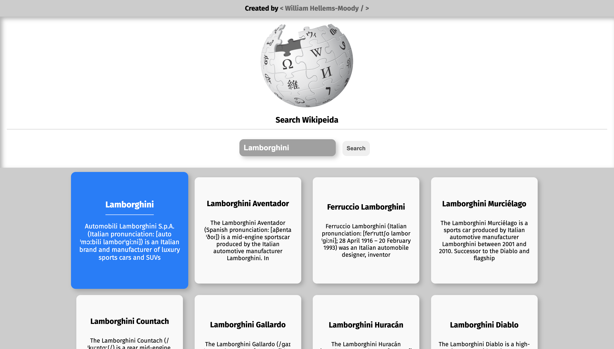
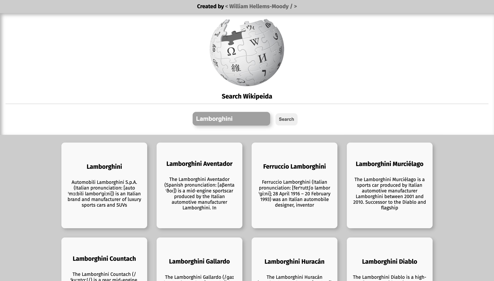

<!-- PROJECT LOGO -->
 

  <h2 align="center">Wikipedia Search App</h3>
    
  

    View Project Demo
     
    <a href="https://wikipedia-search-demo.williamhmoody.com">View Demo</a>
  

<!-- TABLE OF CONTENTS -->

  
Table of Contents

  <ol>
    <li>
      <a href="#about-the-project">About The Project</a>
      <ul>
        <li><a href="#built-with">Built With</a></li>
      </ul>
    </li>
    <li><a href="#usage">Usage</a></li>
    <li><a href="#contact">Contact</a></li>
    <li><a href="#license">License</a></li>
  </ol>

<!-- ABOUT THE PROJECT -->
## About The Project
This simple application uses the wikipedia api to allows users quick access to content normally searched directly on wikipedia's main page. This project is a JavaScript-based project that implements fetch api, along with ES6.

(<a href="#readme-top" style="color: red;">back to top</a>)

### Built With

* HTML
* CSS
* JavaScript
* Wikipedia

(<a href="#readme-top">back to top</a>)

<!-- USAGE EXAMPLES -->
## Usage of Application

Any user is able to search any key term using the wikipedia api. 
Once the search request is made, the user will be able to select 
each card and be redirected to the wikipedia page associated with that link and title.

  
   
   
   
  

(<a href="#readme-top">back to top</a>)

<!-- CONTACT -->
## Contact

Project Link: [Wikipedia Search Application Demo](https://wikipedia-search-demo.williamhmoody.com)

(<a href="#readme-top">back to top</a>)

<!-- LICENSE -->
## License

Distributed under the MIT License.

(<a href="#readme-top">back to top</a>)

